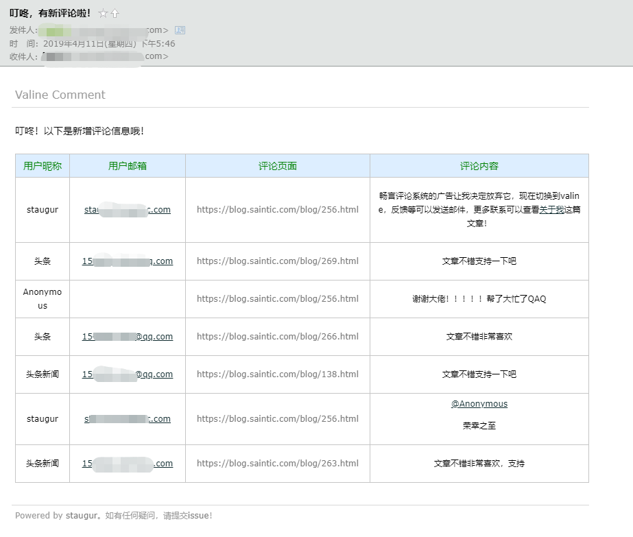

CommentReminder
-----------------------

这是针对[Valine](ttps://valine.js.org "Valine")评论系统的小功能，用以获取系统中的新增评论，并发送提醒给管理员。

运行逻辑：

  - 定时检索leancloud存储的数据与本地对比，发现新增数据后发送邮件提醒。

使用要求：

  - 您可以在Windows、Linux、Mac等系统中使用，只要求安装Python2.7环境，下载地址是https://www.python.org/download/releases/2.7/

  - 有一个可用邮箱

    - QQ邮箱，密码要求是授权码，帮助页面：https://service.mail.qq.com/cgi-bin/help?subtype=1&&id=28&&no=1001256
    - 腾讯企业邮箱，163免费企业邮箱，密码可非授权码
    - 163邮箱，未测试

使用方法：

  - python2.7 CommentReminder.py #-h查看帮助，需要设置的信息都在选项中。
  - 不想带着python命令，可以，`chmod +x CommentReminder.py`赋予脚本执行权即可。
  - 想清除配置？可以，`rm -f /tmp/valine_leancloud_dat`，清除缓存文件即可。

使用示例：

  - `python CommentReminder.py --app-id YourAPPID --app-key YourAPPKey -e xxxx@qq.com -p 授权码`
  - 建议加入到定时任务中，比如5分钟执行一次：`*/5 * * * * python CommentReminder.py`
  - 新增评论时，发送邮件示例图：
    

寻求帮助：

  - email: staugur@email.com 
  - issue: https://github.com/saintic/satic.sdi/issues

